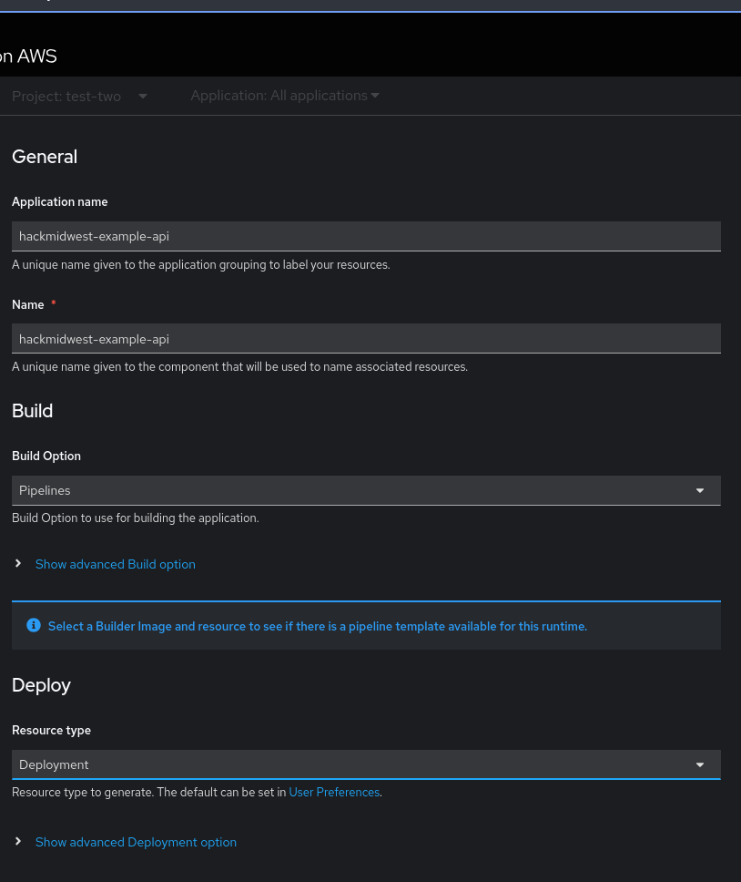

# Hack Midwest 2024 Getting Started with OpenShift AI 
## Contact Information

* Intel, Technical Sales Specialist, Dennis Hitaj ([dennis.hitaj@intel.com](mailto:dennis.hitaj@intel.com))  
* Red Hat, Technical Sales Specialist, Daniel Schimpfoessl ([dds@redhat.com](mailto:dds@redhat.com))

## Resources:
### Rules  
* Event \- [https://hackmidwest.com/index.html\#faq](https://hackmidwest.com/index.html#faq)   
* Prize \- [https://hackmidwest.com/index.html\#prizes](https://hackmidwest.com/index.html#prizes)   
### References  
* Understanding AI \- [Introduction to RHOAI](https://redhatquickcourses.github.io/rhods-intro/rhods-intro/1.33/index.html)   
* OpenShift \- [Documentation](https://docs.redhat.com/en/documentation/openshift_container_platform/4.16)   
* ROSA \- [https://aws.amazon.com/rosa/](https://aws.amazon.com/rosa/)   
* Introduction to Red Hat OpenShift AI 

  * [Overview](https://www.redhat.com/en/technologies/cloud-computing/openshift/openshift-ai)   
  * [Documentation](https://docs.redhat.com/en/documentation/red_hat_openshift_ai_self-managed/2.13)   
  * [Quick Courses](https://redhatquickcourses.github.io/rhods-intro/rhods-intro/1.33/index.html) 
  * [Getting Started Workshop - Fraud Detection](https://docs.redhat.com/en/documentation/red_hat_openshift_ai_self-managed/2-latest/html/openshift_ai_tutorial_-_fraud_detection_example/index)
* APIs and Libraries 
  * [Intel OpenVINO Toolkit](https://www.intel.com/content/www/us/en/developer/tools/openvino-toolkit/overview.html)
  * OPEA \- [https://opea.dev/](https://opea.dev/)
  * Validated Patterns \- [https://validatedpatterns.io/search/?query=amx](https://validatedpatterns.io/search/?query=amx)  
  * LangChain \- [https://python.langchain.com/v0.2/docs/integrations/text\_embedding/](https://python.langchain.com/v0.2/docs/integrations/text_embedding/)   
* Introduction to Intel Resources
  * Intel AMX AI Hardware Acceleration \- [Intel AI Hardware Overview](https://www.intel.com/content/www/us/en/products/docs/accelerator-engines/advanced-matrix-extensions/overview.html)  
  * Intel Sample Code and Notebooks \- [Intel AI Kit Workbench](https://www.intel.com/content/www/us/en/developer/tools/oneapi/ai-analytics-toolkit.html#gs.dpha4c)  
* Sample Applications
  * Red Hat OpenShift AI learning \- [Sample Applications](https://developers.redhat.com/learn/openshift-ai)  
  * Parasol Insurance Demo:      
    * [Code](https://github.com/rh-aiservices-bu/parasol-insurance)  
[Instructions](https://rh-aiservices-bu.github.io/parasol-insurance/modules/index.html)  
  * **Fraud Detection Demo:**  
  * [Code](https://github.com/rh-aiservices-bu/fraud-detection)  
    * [Instructions](https://rh-aiservices-bu.github.io/fraud-detection/fraud-detection-workshop/index.html)  
* Developer Examples  
  * [LLM on OpenShift](https://github.com/rh-aiservices-bu/llm-on-openshift)  

## Environment URLs and Credentials
> **Note**:	See provided file

## Getting Started:
> **Note**: See provided video
To get started, you will be provided with a private git repository. Use the instructions below to create your OpenShift Dev Spaces workspace. 

#### OpenShift Dev Spaces ([example app](https://github.com/redhat-events/devfile-sample-python-basic)) 

* Log into the provided GitHub account containing your repository  
* Add GitHub token for Dev Spaces access  
  * Create fine-grained personal access tokens \- [GitHub Tokens](https://github.com/settings/tokens?type=beta)  
      
    Give the permissions to allow for read/write access to the repository  
      
    After creating the token, save it to a local text file. Make sure to save it somewhere as it cannot be recreated.   
              
* Open the OpenShift console at the URL provided to you and select “ai-hacker” to log in with the credentials provided to you  
    
        
* Open the OpenShift Dev Spaces UI \- look for the application grid icon on the top right of the console.  
    
  Approve all the access requests  
        
* Create new Dev Spaces workspace from your GitHub repository URL  
* 

* Open the Dev Spaces workspace  
    
* Open Terminal (top right pane icon with white bottom)  
* Configure git user and credentials via git push from terminal  
  * See README.md for example [Sample Python App](https://github.com/redhat-events/devfile-sample-python-basic/blob/with-ai-model/README.md)   
* Run your app inside Dev Spaces  
  * See README.md for example [Sample Python App](https://github.com/redhat-events/devfile-sample-python-basic/blob/with-ai-model/README.md)   
  * Expose port  
      
  * Open URL in tab or link inside Dev Spaces  
      
* Edit, commit and view

#### OpenShift AI

* Open OpenShift AI from app menu  
    
* Log In using OpenShift Credentials  
    
* You already have your team Data Science project setup with   
      * Data Connections for two S3 buckets  
* For directions follow tutorial for Fraud Detection app for workbenches setup  
      * DataScience Project is already created  
      * Storage and Data Connections have been already created  
      * [Fraud Detection Workshop](https://rh-aiservices-bu.github.io/fraud-detection/fraud-detection-workshop/index.html)

#### OpenShift Application
Create an example Python Application

* Create the Python app using your favorite cli or ide. Example…

* Add the appropriate .gitignore (These are helpful [https://github.com/github/gitignore](https://github.com/github/gitignore))  
* Add the project folder into your git repository, commit and push.   
* In the developer perspective in OpenShift create a new application from Git  
  * select your namespace (if not already selected)  
      
  * select “+ add” button and click on the “Import from Git” option  
                
  * Fill out git information during which you will need to add a secret with your GitHub token you created from the previous step   
      
      
  * Use the Builder Image  
      
  * Setup Pipelines  
      
* Add pipelines Trigger url / secret to Github Settings \-\> Webhooks using json type  
  * Use \*github\* secret from Secrets in OpenShift in your project  
      
  * Edit pipeline yaml change ```oc rollout status``` to ```oc rollout restart```
* Bring your model into your application  
  * https://github.com/redhat-events/devfile-sample-python-basic/blob/with-ai-model/app.py

#### MinIO Admin
* [MinIO-console](https://console-openshift-console.apps.rosa.rosa-t8j8w.ft2c.p3.openshiftapps.com/k8s/all-namespaces/route.openshift.io~v1~Route?name=MinIO-console)  
  * Select your team project from the Project dropdown  
  * Open Location Url  
* Username and Password from the credentials file

### RAG Demo
* Task completion application demo using RAG with
  * Redis Vector Database
  * Strapi Headless CMS
  * Quarkus API
  * vLLM model serving on OpenShift
  * LLAMA 3.1 model
  * Keycloak SSO
* [Source Code on Github](https://github.com/redhat-events/ai-hackathon-starter)