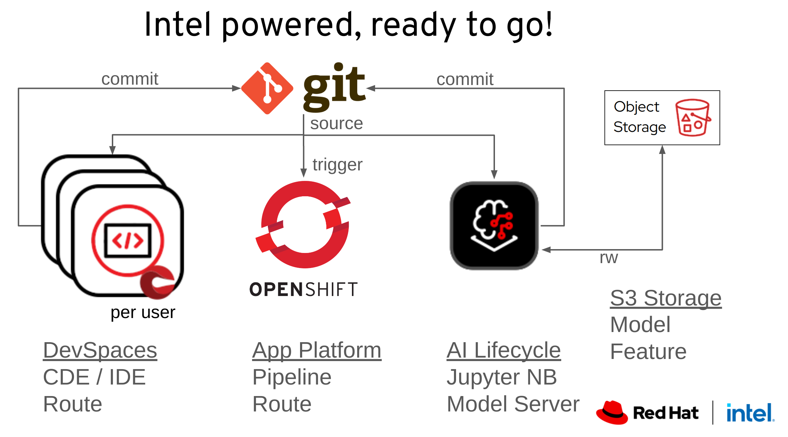

# Anyone who is looking for an environment to host their application can apply here:

## [Team environment access request](https://forms.gle/2f8rFiregPV9EP359) - one request per team.

> ⚠️ **Warning**: Environment provisioning is on a first come first serve basis with best effort support without any guarantees, for educational purposes only. 

> **Note**: We will provide 10 unique user accounts for a shared team environment on   

**OpenShift** with **OpenShift AI** running on 
**Intel** with **AMX** acceleration.

* Getting Started: 
  * [Video](https://youtu.be/vrXaFO8L-3U)
  * [GUIDE](GettingStarted.md)

* OpenShift DevSpaces CDE/IDE [User guide](https://docs.redhat.com/en/documentation/red_hat_openshift_dev_spaces/3.16/html/user_guide/index)
* OpenShift AI example app [Fraud Detection](https://rh-aiservices-bu.github.io/fraud-detection/fraud-detection-workshop/index.html)

* Intel AMX AI Hardware Acceleration - [Intel AI Hardware Overview](https://www.intel.com/content/www/us/en/products/docs/accelerator-engines/advanced-matrix-extensions/overview.html)  

